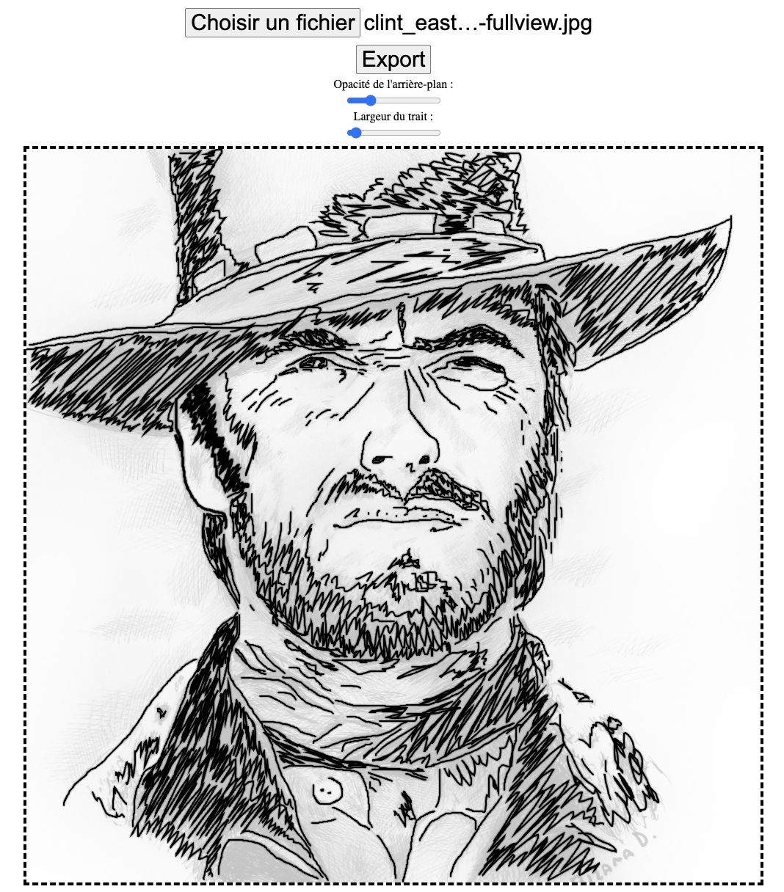

# Simple Drawing

Simple Drawing is a minimalistic drawing application built with HTML, CSS, and JavaScript. It allows users to create drawings on a canvas, customize the background, and save their creations as PNG images.

## Features

- Drawing on the canvas with mouse or touch inputs.
- Ability to upload custom background images.
- Adjustable background opacity through a slider.
- Adjustable line width for drawing.
- Saving the canvas drawing as a PNG file.

## Usage

1. Open the `index.html` file in a web browser.
2. Draw on the canvas using either the mouse or touch inputs.
3. Use the line width slider to adjust the thickness of your strokes.
4. Upload a custom background image using the designated file input.
5. Use the slider to adjust the background image's opacity.
6. Click the "Save" button to export and download the canvas as a PNG image.

## Dependencies

- [Hammer.js](https://hammerjs.github.io/): A JavaScript library for touch and gesture recognition.

## How to Contribute

Contributions are welcome! If you'd like to contribute to Simple Drawing, please follow these steps:

1. Fork the repository.
2. Create a new branch (`git checkout -b feature/your-branch-name`).
3. Make your changes.
4. Commit your changes (`git commit -am 'Add some feature'`).
5. Push to the branch (`git push origin feature/your-branch-name`).
6. Create a new Pull Request.

## License

This project is licensed under the MIT License

